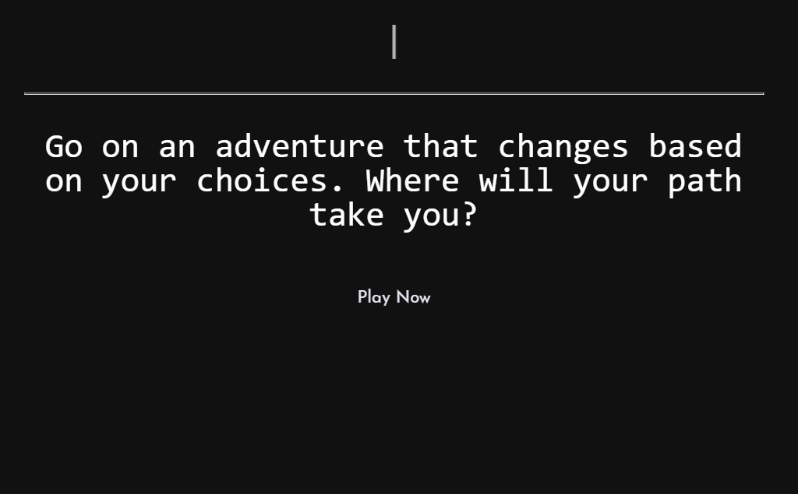
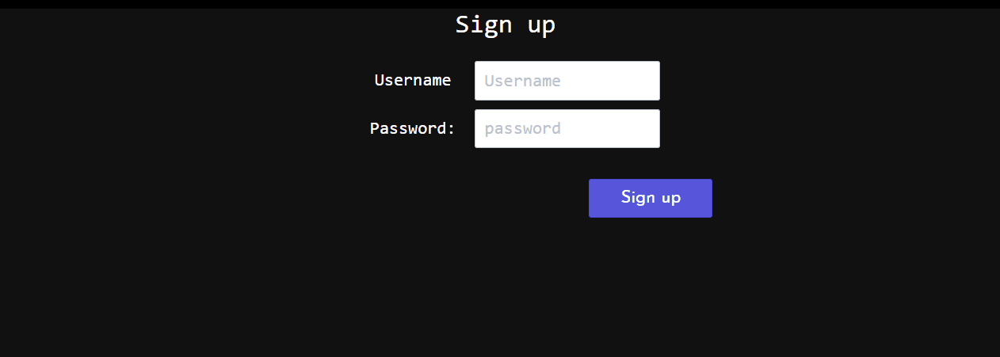
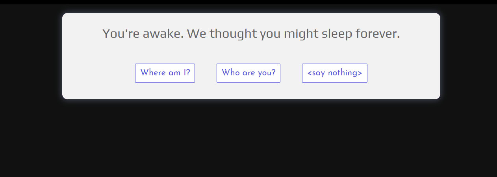

# TextRPG
//explanation of game app

## Getting Started

Link to the repository: https://github.com/project30000/TextRPG 
Link to Heroku deployemnt: https://vast-peak-78938.herokuapp.com/

## User Signin

## Gameplay

## Built With

MongoDB 
Express 
React 
Node 

## Authors

* **Fahad Alam** - *Collaborator* - https://github.com/fahad011686
* **Alojzy Klim** - *Collaborator* - https://github.com/A-Klim01
* **Kemp Atkinson** - *Collaborator* - https://github.com/kempatkinson
* **William Tran** - *Collaborator* - https://github.com/lliwt

## License

This project is licensed under Digital Crab Studios

## Acknowledgments

* Hat tip to Poornima-instructor and Colin Goodale-TA for all their geniusness.

* Inspiration from Coding Boot Camp from Trilogy at Northwestern University.

====================================================================================

This project was bootstrapped with [Create React App](https://github.com/facebook/create-react-app).
